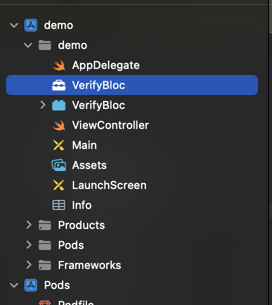
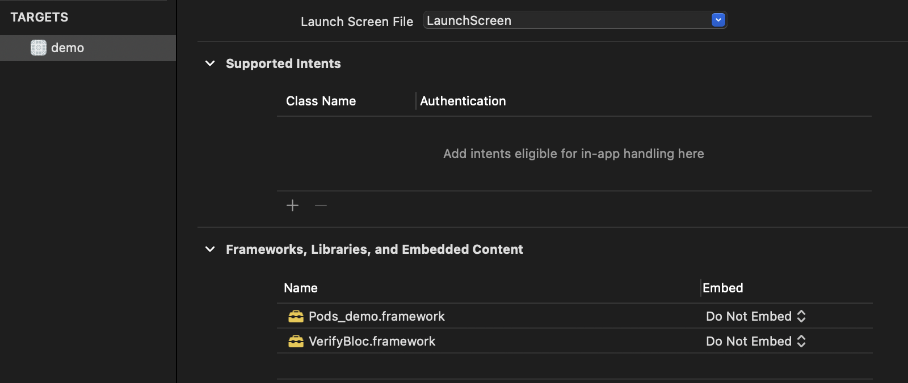
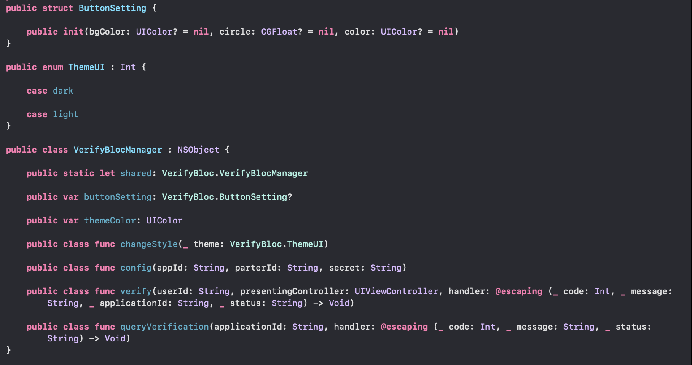

# VerifyBlocSDK

[](https://travis-ci.org/修齐/VerifyBlocSDK)
[](https://cocoapods.org/pods/VerifyBlocSDK)
[](https://cocoapods.org/pods/VerifyBlocSDK)
[](https://cocoapods.org/pods/VerifyBlocSDK)

# VerifyBloc - iOS SDK Guide

## Configuration Overview

- Requires iOS 12.0 or later
- Requires Swift 4.0 or later

## Release Notes

| Version | Release date | Release notes |
| --- | --- | --- |
|  0.2.0  | 2022/12/14  |  |

## How to Onboard
1. Contact support@verifybloc.com for VerifyBloc service details and retrieve your `partnerId`, `applicationId` and `privateKey`
2. Provide us with the following:
    1. Callback path
    2. KYC Flow
    3. Country list
    4. Contact email
    5. App logo or profile photo
3. With the first 2 steps finished, we’ll provide you with VerifyBloc SDK(s) and Demo App(s)

## 集成方法

1. 下载 VerifyBloc 相关资源包，添加项目中集成
    - 将下载 VerifyBloc.framework、VerifyBloc.bundle 添加到项目中，截图如下：
        
        
        

    - Targets → Frameworks，Libraries and Enbedded Content 中可以看到 VerifyBloc.framework，设置 Do Not Embed
    
         
    

2. 通过 CocoaPods 进行集成
    
    ```swift
    pod 'VerifyBlocSDK', '0.2.0'
    ```
    

**注意：**

1. 权限设置
    
    鉴于 SDK 中需要摄像头进行拍照 / 视频录制，故需要 App 提供拍照权限，在 Info.plist 中进行设置 NSCameraUsageDescription
    
    ```swift
    <key>NSCameraUsageDescription</key>
    <string>xxxxx</string>
    ```
    

2. 仅支持真机
    
    鉴于 SDK 中需摄像头权限，故 SDK 不支持模拟器调试
    

## 方法介绍

可供调用方法预览：



1. 页面风格及设计接口

- **public** **class** **func** config(appId: String, parterId: String, secret: String)
    
    功能描述：初始化用户信息.
    
    返回值：无
    
    参数说明：
    
    | 参数 | 类型 | 描述 |
    | --- | --- | --- |
    | appId | String | 申请成功后的 appId |
    | parterId | String | 申请成功后的 partnerId |
    | secret | String | 申请成功后的 privateKey |
- **public** **class** **func** changeStyle(**_** theme: VerifyBloc.ThemeUI)
    
    功能描述：更新风格.
    
    返回值：无
    
    参数说明：
    
    | 参数 | 类型 | 描述 |
    | --- | --- | --- |
    | theme | VerifyBloc.ThemeUI | 风格枚举值 |
- **public** **var** themeColor: UIColor
    
    参数描述：设置主题色
    
- **public** **var** buttonSetting: VerifyBloc.ButtonSetting?
    
    参数描述：设置底部按钮样式
    
    ```swift
    public struct ButtonSetting {
    
        public init(bgColor: UIColor? = nil, circle: CGFloat? = nil, color: UIColor? = nil)
    }
    ```
    
    | 参数 | 类型 | 描述 |
    | --- | --- | --- |
    | bgColor | UIColor | 按钮背景色 |
    | circle | CGFloat | 按钮圆角值 |
    | color | UIColor | 按钮字体色 |
- **public** **class** **func** queryVerification(userId: String, handler: **@escaping** (**_** status: String) -> Void)
    
    功能描述：查询验证状态
    
    返回值：回调返回结果状态status  
    
    | status结果值 | 含义 |
    | --- | --- |
    | approved | 审核通过 |
    | rejected | 审核拒绝 |
    | resubmission_requested | 审核拒绝需重新提交 |
    | 其他值 | 审核中状态 |
    
    参数说明
    
    | 参数 | 类型 | 描述 |
    | --- | --- | --- |
    | userId | String | 用户 Id |
- **public** **class** **func** verify(userId: String, presentingController: UIViewController, handler: **@escaping** (**_** applicationId: String, **_** status: String) -> Void)
    
    功能描述：开始验证
    
    返回值：回调返回结果状态status  以及Kyc流水号applicationId
    
    | status结果值 | 含义 |
    | --- | --- |
    | 空值 | 请求状态异常 |
    | approved | 审核通过 |
    | rejected | 审核拒绝 |
    | resubmission_requested | 审核拒绝需重新提交 |
    | 其他值 | 审核中状态 |
    
    参数说明：
    
    | 参数 | 类型 | 描述 |
    | --- | --- | --- |
    | userId | String | 用户 Id |
    | presentingController | UIViewController | 启动 UIViewController |

2. 枚举类型

    ```swift
    public enum ThemeUI : Int {

        case dark  

        case light
    }
    ```

    | 枚举值 | 描述 |
    | --- | --- |
    | dark | Dark mode |
    | light | Light mode (Default) |
